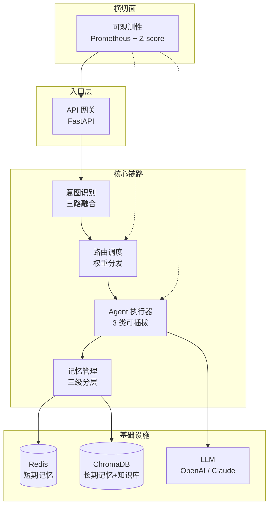
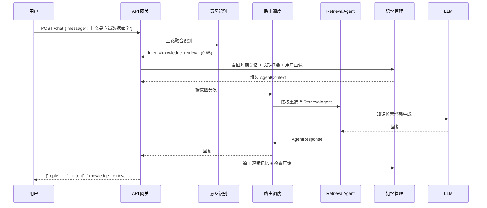
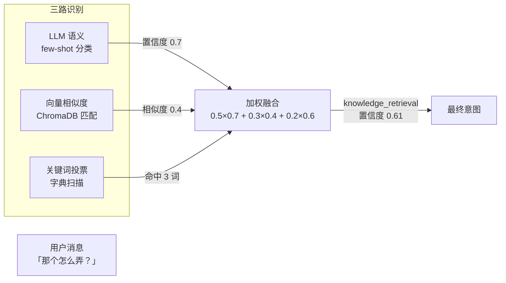
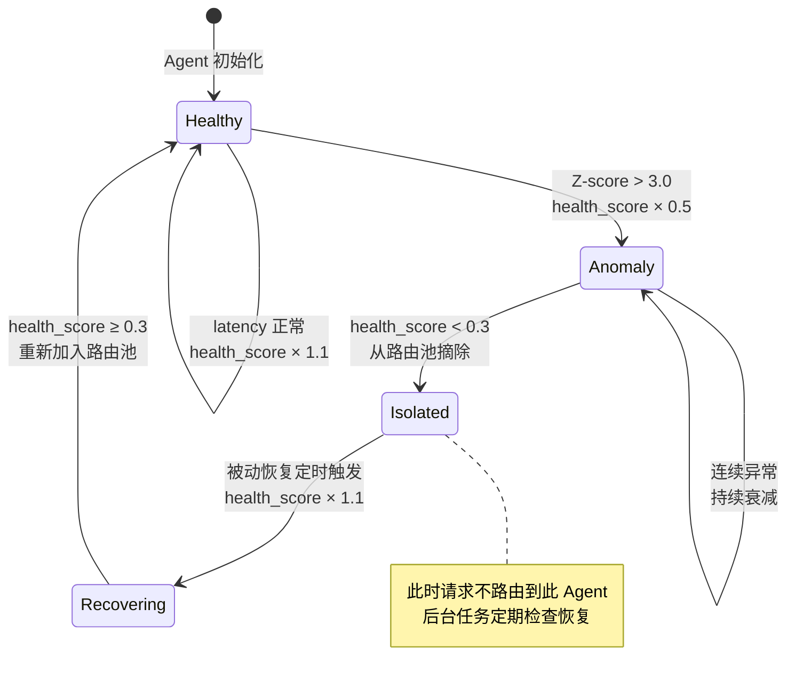
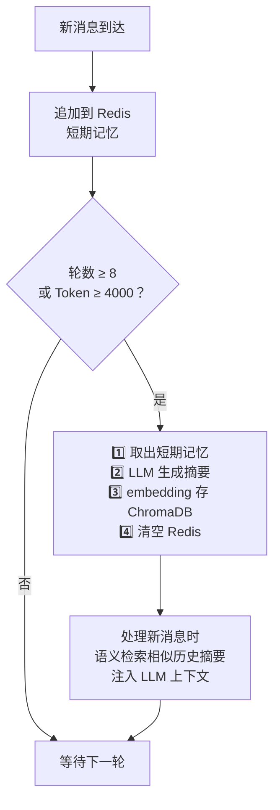

<p align="center">
  <h1 align="center">🧠 Synapse</h1>
  <p align="center">
    <strong>多 Agent 知识检索平台</strong> — 模糊短句秒懂 · 长对话自动压缩 · 故障自愈不中断
  </p>
</p>

<p align="center">
  <a href="#license"></a>
  <a href="https://www.python.org/downloads/"></a>
  <a href="https://fastapi.tiangolo.com/"></a>
  <a href="https://www.docker.com/"></a>
  <a href="https://redis.io/"></a>
  <a href="https://prometheus.io/"></a>
</p>

---

## 📖 目录

- [项目背景](#-项目背景)
- [核心能力](#-核心能力)
- [系统架构](#-系统架构)
- [快速开始](#-快速开始)
- [API 文档](#-api-文档)
- [Python SDK 调用示例](#-python-sdk-调用示例)
- [配置参数](#-配置参数)
- [关键设计深度解析](#-关键设计深度解析)
- [项目结构](#-项目结构)
- [开发指南](#-开发指南)
- [路线图](#-路线图)
- [贡献指南](#-贡献指南)
- [许可证](#-许可证)

---

## 🎯 项目背景

在企业级 AI 应用落地中，我们面临四个棘手的挑战：

| 痛点 | 具体表现 | Synapse 方案 |
|------|---------|-------------|
| 🤷 **意图模糊** | 用户输入 "那个怎么弄？" 无法判断真实需求 | 三路融合意图识别（LLM + 向量 + 关键词） |
| 💸 **Token 膨胀** | 长对话历史全量传递给 LLM，成本飙升 | 自动摘要压缩 + 相似情景按需召回 |
| 🔀 **协作混乱** | 多 Agent 各自为战，无统一调度和失败兜底 | 权重路由 + 降级链 + 100% 兜底回复 |
| 🚨 **发现滞后** | 故障靠人工告警，恢复慢、影响大 | Z-score 实时检测 + 自动摘除 + 自动恢复 |

**Synapse 的定位**：一个生产可用的、自带大脑和免疫系统的多 Agent 框架——不只是调用 LLM，而是「理解意图→调度 Agent→管理记忆→监控健康」的完整闭环。

---

## 🚀 核心能力

```
三路融合意图识别 ──── 模糊短句识别率大幅提升
        │
        ▼
   智能路由调度 ──── 按权重分发，失败自动降级到兜底 Agent
        │
        ▼
   Agent 执行器 ──── RetrievalAgent / SummarizeAgent / FallbackAgent 可插拔
        │
        ▼
   三级分层记忆 ──── Redis 短期 → ChromaDB 长期向量 → 用户画像
        │
        ▼
  Z-score 自愈 ──── 异常 Agent 自动降权摘除，恢复后自动回切
```

---

## 🏗 系统架构

### 整体架构



### 请求处理全链路



---

## ⚡ 快速开始

### 前置要求

- **Docker** ≥ 20.10 + **Docker Compose** ≥ 2.0
- 一个 LLM API Key（[OpenAI](https://platform.openai.com/api-keys) 或 [Anthropic Claude](https://console.anthropic.com/)）

### 1. 克隆项目

```bash
git clone https://github.com/JACK-123666/synapse.git
cd synapse
```

### 2. 配置 API Key

```bash
cp .env.example .env
```

编辑 `.env`，至少填入以下两项：

```ini
LLM_PROVIDER=openai          # 或 claude
LLM_API_KEY=sk-your-key-here # 替换为你的真实 Key
```

### 3. 一键启动

```bash
docker-compose up -d
```

首次启动会自动构建镜像并拉取 Redis、ChromaDB、Prometheus。

```
 ✔ Container synapse-redis      Started
 ✔ Container synapse-chromadb   Started
 ✔ Container synapse-api        Started
 ✔ Container synapse-prometheus Started
```

### 4. 验证服务

```bash
# 健康检查
curl http://localhost:8000/health

# 测试对话
curl -X POST http://localhost:8000/chat \
  -H "Content-Type: application/json" \
  -d '{"session_id": "demo-001", "message": "你好，什么是 RAG？"}'

# 查看指标
curl http://localhost:8000/metrics | head -30
```

### 5. 访问界面

| 服务 | URL |
|------|-----|
| **API 文档 (Swagger)** | http://localhost:8000/docs |
| **API 文档 (ReDoc)** | http://localhost:8000/redoc |
| **Prometheus 监控** | http://localhost:9090 |
| **健康检查** | http://localhost:8000/health |

### 停止服务

```bash
docker-compose down           # 停止容器
docker-compose down -v        # 停止并删除数据卷（清空记忆）
```

---

## 📡 API 文档

### `POST /chat` — 核心对话

**请求体**

```json
{
  "session_id": "user-session-001",
  "message": "什么是 RAG？",
  "user_id": "user-123"
}
```

| 字段 | 类型 | 必填 | 说明 |
|------|------|------|------|
| `session_id` | string | ✅ | 会话唯一标识，用于关联短期记忆 |
| `message` | string | ✅ | 用户输入消息 |
| `user_id` | string | ❌ | 用户 ID，用于个性化画像 |

**响应体**

```json
{
  "reply": "RAG（检索增强生成）是一种将信息检索与大型语言模型结合...",
  "intent": "knowledge_retrieval",
  "agent_used": "retrieval_agent",
  "confidence": 0.85
}
```

| 字段 | 说明 |
|------|------|
| `reply` | Agent 生成的回复文本 |
| `intent` | 识别出的意图标签（knowledge_retrieval / summarize / small_talk） |
| `agent_used` | 实际处理请求的 Agent ID |
| `confidence` | 意图识别融合置信度（0.0 ~ 1.0） |

### `GET /health` — 系统健康

```json
{
  "status": "healthy",
  "modules": {
    "redis": "connected",
    "chromadb": "connected",
    "llm": "connected",
    "agents": {
      "retrieval_agent": { "healthy": true, "health_score": 1.0, "weight": 1.0 },
      "summarize_agent": { "healthy": true, "health_score": 1.0, "weight": 1.0 },
      "fallback_agent": { "healthy": true, "health_score": 1.0, "weight": 1.0 }
    }
  }
}
```

### `GET /metrics` — Prometheus 指标

暴露标准 Prometheus 格式指标，包括：
- `synapse_request_total`（按 agent_id + status）
- `synapse_request_duration_seconds`（直方图）
- `agent_health_score`（实时健康分 Gauge）

---

## 🐍 Python SDK 调用示例

```python
import httpx
import asyncio


async def chat_with_synapse(session_id: str, message: str, user_id: str = None):
    """与 Synapse 对话的 Python 客户端示例。"""
    async with httpx.AsyncClient(base_url="http://localhost:8000") as client:
        resp = await client.post("/chat", json={
            "session_id": session_id,
            "message": message,
            "user_id": user_id,
        })
        resp.raise_for_status()
        return resp.json()


async def main():
    # 第 1 轮
    result = await chat_with_synapse("demo-001", "什么是向量数据库？")
    print(f"[{result['intent']}] {result['agent_used']}: {result['reply'][:80]}...")
    
    # 第 2 轮（利用短期记忆的上下文）
    result = await chat_with_synapse("demo-001", "它和传统数据库有什么区别？")
    print(f"[{result['intent']}] {result['agent_used']}: {result['reply'][:80]}...")


asyncio.run(main())
```

---

## ⚙️ 配置参数

> 所有参数均在 `.env` 或 `app/config.py` 中定义，可通过环境变量覆盖。

### LLM 配置

| 参数 | 默认值 | 说明 |
|------|--------|------|
| `LLM_PROVIDER` | `openai` | LLM 提供商（openai / claude） |
| `LLM_API_KEY` | — | API 密钥（**必须配置**） |
| `LLM_MODEL` | `gpt-4o-mini` | OpenAI 模型名称 |
| `CLAUDE_MODEL` | `claude-3-5-sonnet-20241022` | Claude 模型名称 |
| `LLM_BASE_URL` | `https://api.openai.com/v1` | API 基础 URL（兼容 OpenAI 协议） |
| `EMBEDDING_MODEL` | `text-embedding-3-small` | Embedding 模型 |
| `LLM_TIMEOUT` | `60` | LLM 请求超时（秒） |

### 意图识别

| 参数 | 默认值 | 说明 |
|------|--------|------|
| `INTENT_LLM_WEIGHT` | `0.5` | LLM 语义理解在融合中的权重 |
| `INTENT_VECTOR_WEIGHT` | `0.3` | 向量相似度在融合中的权重 |
| `INTENT_KEYWORD_WEIGHT` | `0.2` | 关键词投票在融合中的权重 |

### 记忆管理

| 参数 | 默认值 | 说明 |
|------|--------|------|
| `SHORT_TERM_MAX_ROUNDS` | `10` | 短期记忆最大轮数 |
| `SHORT_TERM_TTL` | `86400` | 短期记忆过期时间（秒） |
| `SUMMARY_TRIGGER_ROUNDS` | `8` | 触发摘要压缩的轮数阈值 |
| `LONG_TERM_RECALL_K` | `3` | 长期记忆召回数量 |
| `TOKEN_BUDGET` | `4000` | Token 预算上限 |

### 故障恢复

| 参数 | 默认值 | 说明 |
|------|--------|------|
| `ZSCORE_WINDOW_SIZE` | `20` | Z-score 滑动窗口大小 |
| `ZSCORE_THRESHOLD` | `3.0` | Z-score 异常判定阈值 |
| `AGENT_HEALTH_THRESHOLD` | `0.3` | 摘除路由池的健康分阈值 |
| `WEIGHT_DECAY_FACTOR` | `0.5` | 异常时权重衰减因子 |
| `WEIGHT_RECOVERY_FACTOR` | `1.1` | 恢复时权重回调因子 |
| `AGENT_TIMEOUT` | `30` | Agent 执行超时（秒） |

---

## 🔬 关键设计深度解析

### 三路融合意图识别

单一路径的意图识别容易在极端 case 下翻车：LLM 慢且贵、向量对模糊短句无能为力、关键词太粗糙。Synapse 让三路同时投票，按权重融合，任一失败时自动将其权重重分配给其他路。



### Z-score 异常检测与自愈

这是 Synapse 的「免疫系统」——不需要人工设置告警阈值，系统自动学习每个 Agent 的正常响应节奏，发现异常后自动处置。



**核心代码逻辑**（`app/observability/anomaly_detector.py`）：

- 维护每个 Agent 最近 20 次请求耗时的滑动窗口
- 每次新请求到达时，计算均值 μ 和标准差 σ
- Z-score = (当前耗时 - μ) / σ，超过 3.0 即判异常
- 异常 Agent 权重立即减半，连续异常持续衰减
- 健康分 < 0.3 时自动摘除出路由池
- 后台恢复任务每 10 秒检查一次，被动回升健康分

### 记忆自动压缩

不压缩 → Token 线性增长 → 成本失控。Synapse 在对话达到 8 轮（或 Token 估算超 4000）时自动压缩：



---

## 📁 项目结构

```
synapse/
├── app/
│   ├── main.py                  # FastAPI 入口，生命周期管理
│   ├── config.py                # 全局配置（pydantic-settings）
│   ├── storage.py               # Redis / ChromaDB 连接单例
│   │
│   ├── api/
│   │   └── chat.py              # /chat, /health, /metrics 端点
│   │
│   ├── llm/
│   │   └── client.py            # 统一 LLMClient (OpenAI ↔ Claude)
│   │
│   ├── intent/                  # ▸ 意图识别模块
│   │   ├── llm_intent.py        #   LLM few-shot 分类
│   │   ├── vector_intent.py     #   ChromaDB 向量相似度
│   │   ├── keyword_intent.py    #   关键词加权投票
│   │   └── fusion.py            #   三路融合 + 动态权重
│   │
│   ├── router/                  # ▸ 路由调度模块
│   │   ├── registry.py          #   Agent 注册表 + 权重管理
│   │   └── dispatcher.py        #   权重分发 + 降级链
│   │
│   ├── agents/                  # ▸ Agent 执行器
│   │   ├── base.py              #   抽象接口 AgentContext/AgentResponse
│   │   ├── retrieval_agent.py   #   RAG 知识检索 Agent
│   │   ├── summarize_agent.py   #   结构化摘要 Agent
│   │   └── fallback_agent.py    #   100% 可用兜底 Agent
│   │
│   ├── memory/                  # ▸ 记忆管理
│   │   ├── short_term.py        #   Redis List 滑动窗口
│   │   ├── long_term.py         #   ChromaDB 长期向量记忆
│   │   ├── user_profile.py      #   用户画像 (Redis JSON)
│   │   └── compressor.py        #   自动摘要压缩触发器
│   │
│   └── observability/           # ▸ 可观测性
│       ├── metrics.py           #   Prometheus 指标定义
│       └── anomaly_detector.py  #   Z-score 检测 + 权重调节
│
├── docker-compose.yml           # 4 服务编排
├── Dockerfile                   # Python 3.11-slim
├── prometheus.yml               # Prometheus 抓取配置
├── requirements.txt
├── .env.example
├── .gitignore
└── README.md
```

---

## 🛠 开发指南

### 本地运行（不依赖 Docker）

```bash
# 1. 创建虚拟环境
python -m venv .venv
source .venv/bin/activate  # Windows: .venv\Scripts\activate

# 2. 安装依赖
pip install -r requirements.txt

# 3. 启动 Redis & ChromaDB（任选一种）
# 方式 A：用 Docker 单独启动基础设施
docker-compose up -d redis chromadb

# 方式 B：本地安装 Redis 和 ChromaDB

# 4. 配置环境变量
cp .env.example .env
# 编辑 .env，修改 REDIS_URL=redis://localhost:6379/0
# 修改 CHROMA_HOST=localhost

# 5. 启动开发服务器（热重载）
uvicorn app.main:app --reload --host 0.0.0.0 --port 8000
```

### 添加自定义 Agent

```python
# app/agents/my_agent.py
from app.agents.base import AgentContext, AgentResponse, BaseAgent

class MyAgent(BaseAgent):
    agent_id = "my_agent"
    description = "自定义 Agent"

    async def execute(self, context: AgentContext) -> AgentResponse:
        # 你的业务逻辑
        return AgentResponse(reply="Hello from MyAgent!", metadata={})
```

然后在 `app/main.py` 的 `startup()` 中注册：

```python
from app.agents.my_agent import MyAgent
my_agent = MyAgent()
registry.register_agent(my_agent)
registry.register_route("my_intent", ["my_agent", "fallback_agent"])
```

### 监控 Prometheus 指标

```promql
# 请求速率
rate(synapse_request_total[5m])

# P99 延迟
histogram_quantile(0.99, rate(synapse_request_duration_seconds_bucket[5m]))

# Agent 健康分
agent_health_score
```

---

## 🗺 路线图

- [x] 三路融合意图识别
- [x] 权重路由 + 降级链 + 兜底
- [x] Z-score 异常检测与自愈
- [x] 三级分层记忆 + 自动摘要压缩
- [x] Prometheus 可观测性
- [x] Docker Compose 一键部署
- [ ] WebSocket 流式对话支持
- [ ] 多语言意图示例（英文 / 日文）
- [ ] Grafana Dashboard 开箱模板
- [ ] 基于用户反馈的意图识别强化学习
- [ ] Agent 插件市场（社区贡献）

---

## 🤝 贡献指南

欢迎提 Issue 和 PR！请遵循以下流程：

1. **Fork** 本仓库
2. 创建特性分支：`git checkout -b feature/amazing-feature`
3. 提交更改：`git commit -m 'feat: add amazing feature'`
4. 推送到分支：`git push origin feature/amazing-feature`
5. 发起 **Pull Request**

提交信息请遵循 [Conventional Commits](https://www.conventionalcommits.org/) 规范。

---

## 📄 许可证

本项目基于 **MIT License** 开源。详见 [LICENSE](LICENSE) 文件。

---

<p align="center">
  <sub>Built with ❤️ by the Synapse team</sub>
</p>
