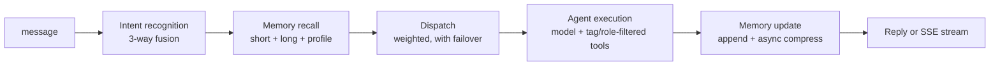
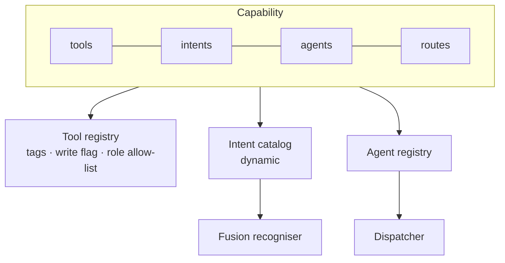

# Synapse

> A multi-agent assistant platform built on LangChain — knowledge-base Q&A, memory recall,
> web search, stock quotes, code repositories, scheduled tasks and plugins, all behind one
> chat endpoint.

**English** · [中文](README.zh.md)

---

## Why this exists

Wiring an LLM into a chat loop is easy. Keeping it useful once real users hit it is not.
Three problems show up every time, and Synapse is organised around them:

| Problem | What goes wrong | How Synapse handles it |
|---|---|---|
| **Ambiguous intent** | "how does that work?" could mean the docs, the chat history, the repo, or small talk. Pure LLM classification is slow and costs money; pure keyword matching is wrong too often. | Three recognisers vote — LLM semantics, vector similarity, keyword hits — and a failing path has its weight redistributed to the survivors automatically. |
| **Token bloat** | Ten turns of history in every prompt is slow and expensive; keeping only the last N loses cross-session memory. | Redis keeps the recent turns; past a threshold a background task compresses them into a summary stored in ChromaDB, recalled by similarity on later messages. |
| **Fragile agents** | One 429, one timeout, and the user gets a 500. | Each intent binds a chain of agents. A primary failure degrades to a backup, then to a fallback agent that never calls the LLM. |

---

## Capabilities

| Capability | How to use it | Under the hood |
|---|---|---|
| **Knowledge Q&A (RAG)** | Create a base with `POST /knowledge-bases`, upload txt / md / pdf / docx / html / code, then just ask | Chunk → embed → permission-filtered retrieval → answers with citations. Private or shared bases. |
| **Memory** | "What did I ask you last time?" | Short-term in Redis (24h TTL), long-term summaries in ChromaDB, plus a lightweight user profile. |
| **Web search** | The model decides whether to search during knowledge Q&A | Bing search, source links cited in the answer. |
| **Web fetching** | Paste a link and say "summarise this" | Main-content extraction (trafilatura), SSRF protection, optional save-to-knowledge-base. |
| **Stock quotes** | "What is 太极实业 trading at?" | Tencent Finance quote API — A-shares, HK and US, resolved from a company name. |
| **Repository assistant** | Connect GitHub / GitLab / local Git via `POST /repos`, then "show recent commits" | Commits, issues, PRs, file reads, code search, changelogs, indexing into a knowledge base. Write actions require admin opt-in **and** per-action confirmation. |
| **Scheduled tasks** | "Every day at 9am, summarise new commits and push to Feishu" | APScheduler with DB persistence; prompt / web-watch / knowledge-sync jobs; Feishu, WeCom and DingTalk webhooks. |
| **Plugins** | Drop a file into `plugins/`, call `POST /plugins/reload` | Hot-reloadable local Python plugins plus MCP servers, with per-role tool allow-lists. |

---

## Architecture

A request walks through six stages:


```mermaid
flowchart LR
    M[message] --> I[Intent recognition<br/>3-way fusion]
    I --> R[Memory recall<br/>short + long + profile]
    R --> D[Dispatch<br/>weighted, with failover]
    D --> A[Agent execution<br/>model + tag/role-filtered tools]
    A --> U[Memory update<br/>append + async compress]
    U --> O[Reply or SSE stream]
```

**One capability = tools + intents + agents + routes.** Built-ins and plugins implement the same
`Capability` interface, so adding a capability never touches the entry point:


```mermaid
flowchart TB
    subgraph CAP[Capability]
        T[tools] --- I2[intents] --- AG[agents] --- RT[routes]
    end
    CAP --> TR[Tool registry<br/>tags · write flag · role allow-list]
    CAP --> IC[Intent catalog<br/>dynamic]
    CAP --> AR[Agent registry]
    IC --> F[Fusion recogniser]
    AR --> DP[Dispatcher]
```

### Design notes

**Intent fusion.** The catalog is dynamic — every capability and plugin registers its own
`IntentSpec` (description, keywords, examples) and all three recognisers pick it up. Weights are
0.5 (LLM) / 0.3 (vector) / 0.2 (keyword); a failed path has its weight redistributed
proportionally. When the two cheap local paths agree with high confidence, the LLM path is skipped
entirely.

**Failover chains.** `knowledge_retrieval` → `retrieval_agent` → `fallback_agent`;
plugin intents → `<plugin>_agent` → `general_agent` → `fallback_agent`. The fallback agent never
calls an LLM, so a reply is guaranteed.

**Prompt stability.** System prompts contain only static instructions. Anything volatile —
retrieved knowledge, recalled memories, the user profile — is appended as a *context block at the
end* of the message list. That keeps the system prompt byte-identical across requests, which is
what lets compiled agent graphs and upstream prefix caches actually be reused.

**Storage that degrades instead of failing.** Redis and ChromaDB both fall back automatically
when the real service is unreachable (in-process `fakeredis` / ChromaDB's embedded persistent
client), so a single-machine install needs no Docker at all. `/health` reports which backend is
live rather than hiding it.

---

## Quick start

### Docker (recommended)

```bash
git clone https://github.com/JACK-123666/synapse.git && cd synapse
cp .env.example .env          # fill in LLM_API_KEY
docker compose up -d
```

Then open <http://localhost:8000/chat>, or <http://localhost:8000/docs> for Swagger.

### Local, no Docker

```bash
python -m venv .venv && .venv/Scripts/activate   # Windows
pip install -r requirements.txt

cp .env.example .env          # fill in LLM_API_KEY
uvicorn app.main:app --port 8000
```

Redis and ChromaDB are optional — without them the app falls back to in-process storage
automatically and logs a warning.

### Try it

```bash
curl -s -X POST http://localhost:8000/chat \
  -H "Content-Type: application/json" \
  -d '{"session_id":"demo","message":"What is a vector database?"}'
```

### Team deployment

Set `AUTH_ENABLED=true` and `ADMIN_PASSWORD` in `.env`, exchange credentials for a token via
`POST /auth/login` (or mint an API key with `POST /auth/api-keys`), and let admins add members
with `POST /users`. For PostgreSQL: `docker compose --profile postgres up -d` and set
`DATABASE_URL`.

---

## Configuration

Everything lives in `.env` — see [`.env.example`](.env.example) for the complete list.

### Models

| Variable | Default | Notes |
|---|---|---|
| `LLM_PROVIDER` | `openai` | `openai` / `deepseek` / `claude` |
| `LLM_API_KEY` | — | **required** |
| `DEEPSEEK_MODEL` | `deepseek-chat` | used when provider is `deepseek` |
| `EMBEDDING_PROVIDER` | `openai` | **`local`** for DeepSeek users — see below |

> **DeepSeek users:** DeepSeek has no embedding endpoint. Leaving `EMBEDDING_PROVIDER=openai`
> makes every request fall back to the DeepSeek key against OpenAI and fail with 401. Set
> `EMBEDDING_PROVIDER=local` to use a bundled ONNX model (~80 MB, downloaded once) — no API key
> at all, and the intent index and knowledge base then share one vector space.

### Storage

| Variable | Default | Notes |
|---|---|---|
| `REDIS_MODE` | `auto` | `auto` degrades to in-process memory / `server` requires a real Redis / `memory` never connects |
| `CHROMA_MODE` | `auto` | `auto` degrades to the embedded client / `server` / `embedded` |
| `DATABASE_URL` | empty | empty = SQLite under `data/` |

### Tuning

| Variable | Default | Notes |
|---|---|---|
| `SHORT_TERM_MAX_ROUNDS` | 10 | turns kept in Redis |
| `SUMMARY_TRIGGER_ROUNDS` | 8 | turns before background compression kicks in |
| `RAG_CHUNK_SIZE` / `RAG_TOP_K` | 800 / 5 | chunking and retrieval |
| `INTENT_SHORT_CIRCUIT` | true | skip the LLM intent call when the cheap paths agree |
| `INTENT_LLM_TIMEOUT` | 5.0 | the LLM intent path gets its own timeout |
| `AGENT_TIMEOUT` | 30 | per-agent timeout before failover |
| `REPO_WRITE_ENABLED` | false | repository write actions |

---

## API

| Group | Endpoints | Access |
|---|---|---|
| Chat | `POST /chat`, `POST /chat/stream` (SSE), `GET /chat` (UI) | any user |
| System | `GET /health`, `GET /metrics`, `GET /models`, `GET /capabilities` | public / user |
| Auth | `POST /auth/login`, `GET /auth/me`, `PATCH /auth/password`, `/auth/api-keys` | public / user |
| Users | `GET/POST /users`, `PATCH/DELETE /users/{id}` | admin |
| Knowledge | `/knowledge-bases` CRUD, `/{id}/documents`, `/{id}/urls`, `/{id}/reindex`, `/search` | owner / admin |
| Memory | `GET /memories`, `/memories/search`, `/memories/sessions`, `/memories/profile` | self |
| Repos | `/repos` CRUD, `/{id}/test`, `/{id}/commits`, `/{id}/changelog`, `/{id}/index`, `/repos/actions` | owner / admin |
| Schedules | `/schedules` CRUD, `/parse`, `/{id}/run`, `/{id}/runs` | owner / admin |
| Plugins | `/plugins` list/enable/disable/reload, `/plugins/mcp/servers`, `/plugins/policies` | admin |

Full interactive reference at `/docs`.

---

## Project structure

```
app/
├── main.py                     FastAPI entry; lifespan boot order
├── config.py                   Every tunable (pydantic-settings)
├── store.py                    Redis + ChromaDB connections, with auto-degradation
│
├── api/                        HTTP layer, one module per resource group
│   ├── chat.py                 POST /chat, POST /chat/stream (SSE), GET /chat
│   ├── system.py               /health, /metrics, /models, /capabilities
│   ├── auth.py                 Login, JWT, API keys, users
│   ├── knowledge.py            Knowledge bases, upload, search, reindex
│   ├── memory.py               Memory browsing, sessions, profile
│   ├── repos.py                Repo connections, commits, changelog, write confirmation
│   ├── schedules.py            Scheduled-task CRUD, cron parsing, run history
│   └── plugins.py              Plugin lifecycle, MCP servers, tool policies
│
├── core/                       Platform substrate — no business logic
│   ├── context.py              RequestContext in contextvars
│   ├── db.py                   SQLAlchemy 2.0 async engine, session_scope
│   ├── security.py             bcrypt, JWT, API-key hashing, Fernet
│   ├── deps.py                 get_current_user / require_admin
│   └── tasks.py                Background-task supervision
│
├── services/
│   ├── chat.py                 Orchestration: prepare → dispatch → update memory
│   ├── users.py                Users, login, API keys
│   └── policies.py             Role → tool allow-list
│
├── llm/
│   ├── config.py               Runtime config (runtime override > .env)
│   ├── factory.py              Builds and caches ChatModel / Embeddings
│   ├── gateway.py              chat() / embed() entry point
│   └── messages.py             dict ↔ LangChain message conversion
│
├── intent/                     Intent recognition
│   ├── catalog.py              Dynamic catalog
│   ├── semantic.py             LLM lane
│   ├── vector.py               Embedding-similarity lane
│   ├── keyword.py              Keyword-voting lane
│   └── blend.py                Fusion + short-circuit + weight redistribution
│
├── router/
│   ├── pool.py                 Agent registry, intent → agent routes
│   └── route.py                Dispatch, weighting, failover, streaming failover
│
├── agents/
│   ├── base.py                 BaseAgent / AgentContext / AgentResponse
│   ├── langchain_agent.py      Tools by tag+role, static prompts, cached graph, ReAct streaming
│   ├── knowledge.py            RetrievalAgent
│   ├── summary.py              SummarizationAgent
│   └── safety.py               FallbackAgent — never raises, never calls the LLM
│
├── capabilities/               One package per capability
│   ├── base.py                 Capability interface
│   ├── manager.py              Registration / hot reload
│   ├── core.py                 The four base agents and their routes
│   ├── knowledge/              loaders · service · tools
│   ├── memory/                 Memory tools + MemoryAgent
│   ├── web/                    fetch · quote · tools
│   ├── repo/                   providers · service · tools
│   └── scheduler/              cron · service
│
├── plugins/                    Local Python plugins, MCP integration
├── memory/                     recent · archive · compress · profile
├── observability/              Anomaly detection & self-healing, Prometheus metrics
├── tools/                      Tool registry, web search
├── models/__init__.py          ORM tables
└── static/index.html           Chat UI (vanilla JS, SSE)

plugins/example_plugin/         Example capability plugin
tests/                          pytest — Redis / Chroma / DB / LLM all replaced by fakes
tools/                          Offline evaluation scripts
```

---

## Development

```bash
pip install -r requirements-dev.txt   # core + test dependencies
pytest                                # 81 tests, ~45s, no network needed
python tools/eval_intent.py --no-llm  # intent-recognition evaluation
python tools/eval_memory.py           # memory token-cost evaluation
```

The test suite replaces every external service with a local fake — `fakeredis`, ChromaDB's
ephemeral client, a temporary SQLite file, and an orchestratable fake chat model. Nothing touches
the network, and the two log lines about a degraded backend will not appear.

---

## Extending

Implement `Capability` and register tools, intents, agents and routes. Drop it into `plugins/`
and call `POST /plugins/reload` — no entry-point changes. See
[`docs/PLUGIN_DEV.md`](docs/PLUGIN_DEV.md) (Chinese).

```python
from langchain_core.tools import tool
from app.capabilities.base import Capability
from app.intent.catalog import IntentSpec

@tool
async def query_order(order_id: str) -> str:
    """Look up an order's status."""
    return f"Order {order_id} has shipped"

class OrderPlugin(Capability):
    name = "order"
    description = "Order lookups"

    def tools(self):
        """本能力对外提供的工具。"""
        return [query_order]

    def intents(self):
        """本能力注册的意图。"""
        return [IntentSpec(name="order_query", description="Order lookups", keywords=["order"])]
```

Declaring only intents and tools is enough — the manager auto-generates `order_agent` and routes
it as `[order_agent, general_agent, fallback_agent]`.

To write just an agent, subclass `LangChainAgent` and set `tool_tags` plus a static
`system_prompt`.

---

## Known limitations

- **Single worker.** Anomaly-detection state, runtime model overrides and APScheduler all live in
  the process. Multi-replica deployment needs them externalised (Redis) and the scheduler pinned
  to one instance. `REDIS_MODE=server` and `CHROMA_MODE=server` are required for that setup.
- **Anomaly detection looks at latency only.** A failing agent that fails *fast* (an immediate
  401, say) never trips the Z-score threshold, so it is never rotated out. The failover chain
  still protects the user.
- **Short-term memory is volatile in fallback mode.** With `REDIS_MODE=auto` and no Redis, session
  history is lost on restart — compressed long-term summaries survive, since they live in Chroma.
- **SSRF has a DNS-rebinding window** between validation and connection. High-security deployments
  should route outbound traffic through a proxy.
- **Local plugins are executable code.** Only install plugins you trust.
- No CI or database migrations yet — schema changes are applied by hand.

---

## License

MIT
