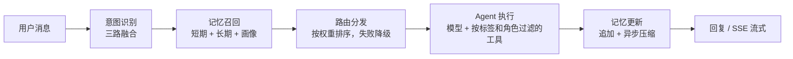
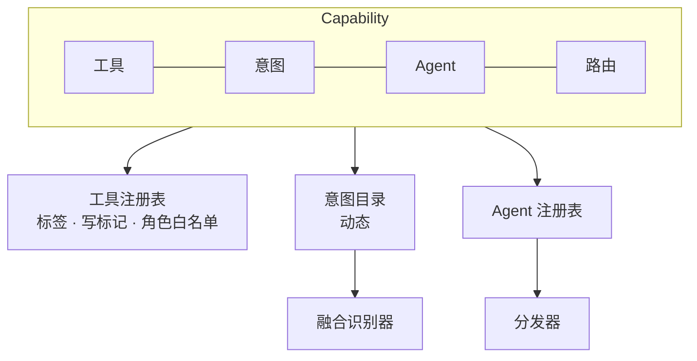

# Synapse

> 基于 LangChain 的多 Agent 智能助手平台 —— 知识库问答、记忆检索、联网搜索、股票行情、
> 代码仓库助手、定时任务与插件扩展，全部收在同一个对话接口后面。

[English](README.md) · **中文**

---

## 为什么做这个

把 LLM 接进一个对话循环很容易，难的是真实用户开始用之后它还好用。有三个问题每次都会撞上，
Synapse 的整体结构就是围绕它们组织的：

| 问题 | 具体会怎样 | Synapse 怎么做 |
|------|-----------|---------------|
| **意图模糊** | 「那个怎么弄」可能是在问文档、翻聊天记录、查代码，也可能只是闲聊。纯 LLM 分类又慢又贵，纯关键词匹配又不够准。 | 三路识别器投票 —— LLM 语义、向量相似度、关键词命中 —— 某一路失败时它的权重自动按比例分给其余两路。 |
| **Token 膨胀** | 每轮都塞十轮历史，又慢又贵；只留最近 N 轮，跨会话的记忆就丢了。 | Redis 保存近期对话；超过阈值后由后台任务压缩成摘要存进 ChromaDB，之后按相似度召回。 |
| **Agent 脆弱** | 一次 429、一次超时，用户就看到 500。 | 每个意图绑定一条 Agent 降级链：主 Agent 失败退到备份，备份失败退到兜底 Agent —— 兜底那个不调 LLM。 |

---

## 能做什么

| 能力 | 怎么用 | 底层实现 |
|------|--------|---------|
| **知识库问答（RAG）** | `POST /knowledge-bases` 建库，上传 txt / md / pdf / docx / html / 代码，然后直接问 | 切片 → 向量化 → 按权限检索 → 带引用回答。支持私有库与共享库 |
| **记忆** | 「我上次问你什么了？」 | 短期记忆存 Redis（24 小时 TTL），长期摘要存 ChromaDB，另有一份轻量用户画像 |
| **联网搜索** | 知识问答时由模型自行判断要不要搜 | Bing 搜索，回答里注明来源链接 |
| **网页抓取** | 贴个链接说「总结一下」 | 正文提取（trafilatura）、防 SSRF、可选择性存入知识库 |
| **股票行情** | 「太极实业现在多少钱？」 | 腾讯财经行情接口，覆盖 A股 / 港股 / 美股，支持按公司名查询 |
| **代码仓库助手** | `POST /repos` 接入 GitHub / GitLab / 本地 Git，然后「看看最近的提交」 | 提交、Issue、PR、读文件、搜代码、生成变更日志、索引进知识库。写操作需要管理员开启**并且**逐个确认 |
| **定时任务** | 「每天早上 9 点总结新提交发飞书」 | APScheduler + 落库；支持提示词 / 网页监控 / 知识库同步；飞书、企微、钉钉 Webhook |
| **插件** | 丢进 `plugins/`，调 `POST /plugins/reload` | 本地 Python 插件热重载，也支持 MCP 服务；可按角色设置工具白名单 |

---

## 架构

一次请求经过六个阶段：



**一个能力 = 工具 + 意图 + Agent + 路由。** 内置能力和插件实现同一个 `Capability` 接口，
因此新增能力永远不需要改动入口文件：



### 设计要点

**意图融合。** 意图目录是动态的 —— 每个能力和插件注册自己的 `IntentSpec`（描述、关键词、示例），
三路识别器自动读取。权重默认 0.5（LLM）/ 0.3（向量）/ 0.2（关键词），某一路失败时它的权重
按比例重新分配。当两路便宜的本地识别结论一致且足够自信时，直接跳过最贵的 LLM 那一路。

**降级链。** `knowledge_retrieval` → `retrieval_agent` → `fallback_agent`；插件意图 →
`<插件>_agent` → `general_agent` → `fallback_agent`。兜底 Agent 不调用任何 LLM，因此永远有回复。

**提示词稳定性。** 系统提示词只包含静态指令。所有会变的内容 —— 检索到的知识、召回的记忆、
用户画像 —— 都作为**上下文块拼在消息序列末尾**。这样系统提示词逐字节稳定，编译好的 Agent 图
和上游的 prefix cache 才能真正被复用。

**存储退化而不是报错。** Redis 和 ChromaDB 在连不上真实服务时都会自动退化（进程内 `fakeredis` /
ChromaDB 内嵌持久化客户端），所以单机安装**完全不需要 Docker**。`/health` 会如实报告当前用的是
哪种后端，而不是把它藏起来。

---

## 快速开始

### Docker（推荐）

```bash
git clone https://github.com/JACK-123666/synapse.git && cd synapse
cp .env.example .env          # 填入 LLM_API_KEY
docker compose up -d
```

打开 <http://localhost:8000/chat>，或 <http://localhost:8000/docs> 看 Swagger。

### 本地直跑（不需要 Docker）

```bash
python -m venv .venv && .venv/Scripts/activate
pip install -r requirements.txt

cp .env.example .env          # 填入 LLM_API_KEY
uvicorn app.main:app --port 8000
```

Redis 和 ChromaDB 都是可选的 —— 没有它们时应用会自动退化到进程内存储并打印一条警告。

### 试一条

```bash
curl -s -X POST http://localhost:8000/chat \
  -H "Content-Type: application/json" \
  -d '{"session_id":"demo","message":"什么是向量数据库？"}'
```

### 团队部署

在 `.env` 里设置 `AUTH_ENABLED=true` 和 `ADMIN_PASSWORD`，用 `POST /auth/login` 换取令牌
（或用 `POST /auth/api-keys` 签一个 API Key），管理员再用 `POST /users` 添加成员。
用 PostgreSQL 的话：`docker compose --profile postgres up -d`，并设置 `DATABASE_URL`。

---

## 配置

全部配置在 `.env` 里 —— 完整清单见 [`.env.example`](.env.example)。

### 模型

| 变量 | 默认值 | 说明 |
|------|--------|------|
| `LLM_PROVIDER` | `openai` | `openai` / `deepseek` / `claude` |
| `LLM_API_KEY` | — | **必填** |
| `DEEPSEEK_MODEL` | `deepseek-chat` | provider 为 `deepseek` 时生效 |
| `EMBEDDING_PROVIDER` | `openai` | **DeepSeek 用户请设为 `local`**，见下 |

> **DeepSeek 用户注意：** DeepSeek 不提供 embedding 接口。保持 `EMBEDDING_PROVIDER=openai`
> 会让每个请求都拿 DeepSeek 的 key 去请求 OpenAI 接口，必然 401。改成 `local` 会使用内置的
> ONNX 模型（约 80MB，首次下载一次），不需要任何 API Key —— 而且意图索引与知识库从此共用
> 同一个向量空间。

### 存储

| 变量 | 默认值 | 说明 |
|------|--------|------|
| `REDIS_MODE` | `auto` | `auto` 连不上就退化为进程内内存 / `server` 强制连真实服务 / `memory` 从不连接 |
| `CHROMA_MODE` | `auto` | `auto` 退化为内嵌客户端 / `server` / `embedded` |
| `DATABASE_URL` | 空 | 留空 = 使用 `data/` 下的 SQLite |

### 调优

| 变量 | 默认值 | 说明 |
|------|--------|------|
| `SHORT_TERM_MAX_ROUNDS` | 10 | Redis 里保留的对话轮数 |
| `SUMMARY_TRIGGER_ROUNDS` | 8 | 触发后台压缩的轮数阈值 |
| `RAG_CHUNK_SIZE` / `RAG_TOP_K` | 800 / 5 | 切片长度与检索条数 |
| `INTENT_SHORT_CIRCUIT` | true | 便宜的本地两路一致时跳过 LLM 意图识别 |
| `INTENT_LLM_TIMEOUT` | 5.0 | LLM 意图路有独立超时，超时即视为该路失败 |
| `AGENT_TIMEOUT` | 30 | 单个 Agent 的超时，超时触发降级 |
| `REPO_WRITE_ENABLED` | false | 仓库写操作总开关 |

---

## 接口

| 分组 | 端点 | 权限 |
|------|------|------|
| 对话 | `POST /chat`、`POST /chat/stream`（SSE）、`GET /chat`（页面） | 登录用户 |
| 系统 | `GET /health`、`GET /metrics`、`GET /models`、`GET /capabilities` | 公开 / 用户 |
| 鉴权 | `POST /auth/login`、`GET /auth/me`、`PATCH /auth/password`、`/auth/api-keys` | 公开 / 用户 |
| 用户 | `GET/POST /users`、`PATCH/DELETE /users/{id}` | 管理员 |
| 知识库 | `/knowledge-bases` 增删改查、`/{id}/documents`、`/{id}/urls`、`/{id}/reindex`、`/search` | 所有者 / 管理员 |
| 记忆 | `GET /memories`、`/memories/search`、`/memories/sessions`、`/memories/profile` | 本人 |
| 仓库 | `/repos` 增删改查、`/{id}/test`、`/{id}/commits`、`/{id}/changelog`、`/{id}/index`、`/repos/actions` | 所有者 / 管理员 |
| 定时任务 | `/schedules` 增删改查、`/parse`、`/{id}/run`、`/{id}/runs` | 所有者 / 管理员 |
| 插件 | `/plugins` 列表 / 启停 / 重载、`/plugins/mcp/servers`、`/plugins/policies` | 管理员 |

完整的交互式文档在 `/docs`。

---

## 目录结构

```
app/
├── main.py                     FastAPI 入口；lifespan 启动顺序
├── config.py                   所有可配参数（pydantic-settings）
├── store.py                    Redis / ChromaDB 连接，含自动退化
│
├── api/                        HTTP 层，每个资源组一个模块
│   ├── chat.py                 POST /chat、POST /chat/stream（SSE）、GET /chat
│   ├── system.py               /health、/metrics、/models、/capabilities
│   ├── auth.py                 登录、JWT、API Key、用户
│   ├── knowledge.py            知识库、上传、检索、重建索引
│   ├── memory.py               记忆浏览、会话、画像
│   ├── repos.py                仓库连接、提交、变更日志、写操作确认
│   ├── schedules.py            定时任务增删改查、cron 解析、执行历史
│   └── plugins.py              插件生命周期、MCP 服务、工具白名单
│
├── core/                       平台底座，不含业务逻辑
│   ├── context.py              contextvars 里的 RequestContext
│   ├── db.py                   SQLAlchemy 2.0 异步引擎、session_scope
│   ├── security.py             bcrypt、JWT、API Key 哈希、Fernet 加密
│   ├── deps.py                 get_current_user / require_admin
│   └── tasks.py                后台任务托管
│
├── services/
│   ├── chat.py                 对话编排：prepare → dispatch → 更新记忆
│   ├── users.py                用户、登录、API Key
│   └── policies.py             角色 → 工具白名单
│
├── llm/
│   ├── config.py               运行时配置（运行时覆盖 > .env）
│   ├── factory.py              创建并缓存 ChatModel / Embeddings
│   ├── gateway.py              chat() / embed() 统一入口
│   └── messages.py             dict 与 LangChain 消息互转
│
├── intent/                     意图识别
│   ├── catalog.py              动态意图目录
│   ├── semantic.py             LLM 语义路
│   ├── vector.py               向量相似度路
│   ├── keyword.py              关键词投票路
│   └── blend.py                融合 + 短路 + 权重重分配
│
├── router/
│   ├── pool.py                 Agent 注册表、意图 → Agent 路由表
│   └── route.py                分发、权重排序、降级（含流式）
│
├── agents/
│   ├── base.py                 BaseAgent / AgentContext / AgentResponse
│   ├── langchain_agent.py      按标签+角色选工具、静态提示词、缓存 Agent 图、ReAct 流式
│   ├── knowledge.py            RetrievalAgent
│   ├── summary.py              SummarizationAgent
│   └── safety.py               FallbackAgent —— 绝不抛异常、绝不调 LLM
│
├── capabilities/               每个能力一个包
│   ├── base.py                 Capability 接口
│   ├── manager.py              注册 / 热重载
│   ├── core.py                 四个基础 Agent 及其路由
│   ├── knowledge/              loaders · service · tools
│   ├── memory/                 记忆工具 + MemoryAgent
│   ├── web/                    fetch · quote · tools
│   ├── repo/                   providers · service · tools
│   └── scheduler/              cron · service
│
├── plugins/                    本地 Python 插件、MCP 接入
├── memory/                     recent · archive · compress · profile
├── observability/              异常检测与自愈、Prometheus 指标
├── tools/                      工具注册表、联网搜索
├── models/__init__.py          ORM 表
└── static/index.html           聊天页（原生 JS + SSE）

plugins/example_plugin/         示例能力插件
tests/                          pytest —— Redis / Chroma / 数据库 / LLM 全部换成本地替身
tools/                          离线评测脚本
```

---

## 开发与测试

```bash
pip install -r requirements-dev.txt   # 核心 + 测试依赖
pytest                                # 81 个用例，约 45 秒，不需要联网
python tools/eval_intent.py --no-llm  # 意图识别评测
python tools/eval_memory.py           # 记忆 Token 开销评测
```

测试套件把每一个外部依赖都换成了本地替身 —— `fakeredis`、ChromaDB 的临时客户端、
临时 SQLite 文件，以及一个可编排回复的假聊天模型。整个过程不碰网络。

---

## 扩展

实现 `Capability` 并注册工具、意图、Agent 和路由。放进 `plugins/` 后调用
`POST /plugins/reload` 即可加载，无需改动入口文件。详见
[`docs/PLUGIN_DEV.md`](docs/PLUGIN_DEV.md)。

```python
from langchain_core.tools import tool
from app.capabilities.base import Capability
from app.intent.catalog import IntentSpec

@tool
async def query_order(order_id: str) -> str:
    """查询订单状态。"""
    return f"订单 {order_id} 已发货"

class OrderPlugin(Capability):
    name = "order"
    description = "订单查询"

    def tools(self):
        """本能力对外提供的工具。"""
        return [query_order]

    def intents(self):
        """本能力注册的意图。"""
        return [IntentSpec(name="order_query", description="订单查询", keywords=["订单"])]
```

只声明工具和意图就够了 —— 管理器会自动生成 `order_agent`，并把它路由为
`[order_agent, general_agent, fallback_agent]`。

只想写一个 Agent 的话，继承 `LangChainAgent`，设置 `tool_tags` 与一个静态的
`system_prompt` 即可。

---

## 已知限制

- **单 worker。** 异常检测状态、运行时模型覆盖、APScheduler 都在进程内。多副本部署需要把它们
  外置到 Redis，并让调度器只在一个实例上运行 —— 那种部署必须设置 `REDIS_MODE=server` 与
  `CHROMA_MODE=server`。
- **异常检测只看延迟。** 一个「快速失败」的 Agent（比如立刻返回 401）永远不会触发 Z-score
  阈值，因此不会被摘出轮换。降级链仍然保护着用户。
- **退化模式下短期记忆不持久。** `REDIS_MODE=auto` 且没有 Redis 时，会话历史在重启后丢失；
  压缩出来的长期摘要不受影响（它们存在 Chroma 里）。
- **SSRF 防护存在 DNS 重绑定窗口。** 校验与实际连接之间有时间差，高安全场景建议走出口代理。
- **本地插件是可执行代码**，只应安装可信的插件。
- 暂未配置 CI 与数据库迁移工具 —— schema 变更目前靠手工执行。

---

## 许可证

MIT
