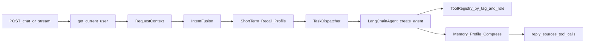

# Synapse 项目架构清单（LangChain 全能助手改造后）

> 更新日期：2026-10-05
> 基线：`master` 提交 `d5a5ef3` + 本次改造（LangChain 1.x 全能助手，含原未提交的 Function Calling 改动）
> 验证：`pytest` 78 项全部通过；`tools/eval_intent.py --no-llm` 的向量路、关键词路结果与改造前逐条一致；`tools/eval_memory.py` 20 轮 Token 数与改造前逐轮一致

---

## 1. 项目概览

| 项目 | 内容 |
|------|------|
| 定位 | 基于 LangChain 的多 Agent 全能智能助手：知识库问答、记忆检索、网页抓取、代码仓库助手、定时任务、插件扩展 |
| 运行时 | Python 3.11（Dockerfile）；本地开发 / 测试使用 Python 3.10 或 3.11（chromadb 0.4.24 需要 numpy<2，不支持 3.13） |
| Web 框架 | FastAPI 0.110（未升级）+ Uvicorn ≥0.31（单 worker） |
| Agent 框架 | LangChain 1.4（`create_agent`、`@tool`、ChatModel）、LangGraph 1.2、langchain-mcp-adapters 0.3 |
| 数据存储 | Redis（短期记忆、画像、任务锁）、ChromaDB 0.4.24（意图示例、长期记忆、知识库）、SQLite / PostgreSQL（用户、知识库元数据、仓库连接、定时任务、插件状态） |
| 鉴权 | JWT + API Key，角色 admin / user；`AUTH_ENABLED=false` 时为本地管理员模式 |
| 监控 | `prometheus_client` 暴露 `/metrics` |
| 前端 | `app/static/index.html`（原生 JS）：流式输出、登录框、工具调用与引用来源展示 |
| 部署 | `docker-compose.yml`：synapse-api + redis + chromadb + prometheus，可选 postgres profile；挂载 `./data`、`./plugins` |
| 测试 | `tests/` 下 78 个 pytest 用例，Redis / Chroma / 数据库 / LLM / Embedding 全部使用本地替身 |

### 依赖变化（只做必要升级）

| 依赖 | 改造前 | 改造后 | 原因 |
|------|--------|--------|------|
| pydantic | 2.6.4 | ≥2.11 | LangChain 要求 ≥2.7.4，mcp 要求 ≥2.11 |
| pydantic-settings | 2.2.1 | ≥2.5.2 | mcp 要求 |
| uvicorn | 0.29.0 | ≥0.31.1 | mcp 要求 |
| httpx | 0.27.0 | ≥0.27.1, <0.28 | mcp 要求 ≥0.27.1；fastapi 0.110 的 TestClient 不兼容 0.28 |
| posthog | 未锁定 | <6 | chromadb 0.4.24 按旧签名调用，6.x 会在每次 Chroma 操作时报错 |
| fastapi / chromadb / redis / prometheus-client | — | 不变 | 实测 fastapi 0.110 与 pydantic 2.13 兼容 |

新增：langchain、langchain-core、langchain-openai、langchain-anthropic、langchain-text-splitters、langchain-mcp-adapters、mcp、sqlalchemy[asyncio]、aiosqlite、asyncpg、apscheduler、bcrypt、pyjwt、cryptography、trafilatura、pypdf、python-docx、pyyaml、python-multipart，以及测试用的 pytest、pytest-asyncio、fakeredis。未使用 langchain-chroma（它要求 chromadb ≥1.3.5）。

---

## 2. 目录与模块清单

### 2.1 入口与平台底座

| 文件 | 职责 |
|------|------|
| `app/main.py` | FastAPI 实例与路由注册；`lifespan` 负责启动和关闭（原 `@app.on_event` 中的步骤全部保留） |
| `app/config.py` | 全局配置；原有配置项不变，新增数据目录、数据库、鉴权、RAG、网页、仓库、调度、插件、LLM 后端、Embedding 提供方等配置 |
| `app/store.py` | Redis / ChromaDB 单例；Redis 加了连接超时；Chroma 连接失败后 30 秒冷却，并关闭遥测 |
| `app/core/context.py` | 请求上下文（contextvars）：当前用户、角色、会话、记忆用户、请求级模型覆盖 |
| `app/core/db.py` | SQLAlchemy 2.0 异步引擎、`session_scope`、`init_db` |
| `app/core/security.py` | bcrypt 密码、JWT、API Key（只存 SHA-256）、Fernet 加密（仓库令牌） |
| `app/core/deps.py` | `get_current_user`（JWT / API Key / 本地管理员）、`require_admin` |
| `app/models/__init__.py` | ORM：User、ApiKey、KnowledgeBase、Document、RepoConnection、PendingAction、Schedule、ScheduleRun、PluginState、McpServer、ToolPolicy |
| `app/services/chat.py` | 对话编排（从原 `/chat` 处理函数抽出，链路不变），提供 `chat()` 和 `stream()` 两个入口 |
| `app/services/users.py` | 初始管理员、用户增删改、登录、API Key |
| `app/services/policies.py` | 角色工具白名单（持久化 + 加载到注册表） |

### 2.2 LLM 层

| 文件 | 职责 |
|------|------|
| `app/llm/factory.py` | 按配置创建并缓存 `ChatOpenAI`（OpenAI / DeepSeek）、`ChatAnthropic`（Claude）、`OpenAIEmbeddings` 或本地 ONNX Embeddings |
| `app/llm/config.py` | `LLMRuntimeConfig`：运行时覆盖 > 环境变量；供模型工厂读取 |
| `app/llm/gateway.py` | `LLMClient`：chat / embed 统一入口，全部委托工厂（单一 LangChain 后端，原 httpx 实现已移除） |
| `app/llm/messages.py` | dict 消息与 LangChain 消息互转、提取文本 |

### 2.3 Agent 与能力

| 文件 | 职责 |
|------|------|
| `app/agents/base.py` | `AgentContext`（新增 model_override / user_role / allowed_tools 等字段）、`AgentResponse`、`BaseAgent`（新增默认的 `stream()`） |
| `app/agents/langchain_agent.py` | `LangChainAgent` 基类（`create_agent` + 按标签选工具，支持流式）、`GeneralAgent` |
| `app/agents/knowledge.py` | `RetrievalAgent`：原有三套 prompt 与意图分支保留；增加 RAG 知识库检索；联网工具改由注册表提供 |
| `app/agents/summary.py` | `SummarizationAgent`：改为 LangChain 实现，收集内容的逻辑不变 |
| `app/agents/safety.py` | `FallbackAgent`：未改动 |
| `app/capabilities/base.py` / `manager.py` | `Capability` 接口与管理器：注册工具 / 意图 / Agent / 路由；只声明意图时自动生成 `<能力>_agent` |
| `app/capabilities/core.py` | 原 3 个 Agent + 原 3 条路由（与改造前一致）+ 通用 Agent + `general_task` |
| `app/capabilities/knowledge/` | RAG：解析（loaders）、切片入库与权限检索（service）、LangChain 检索器（retriever）、工具 |
| `app/capabilities/memory/` | 记忆检索工具与 `MemoryAgent` |
| `app/capabilities/web/` | SSRF 防护抓取、正文提取、`web_search` / `fetch_url` / `save_url_to_knowledge` 工具、`WebAgent` |
| `app/capabilities/repo/` | GitHub / GitLab / 本地 Git 访问层、连接管理、changelog、索引入知识库、写操作待确认流程、`RepoAgent` |
| `app/capabilities/scheduler/` | cron 校验与自然语言解析、APScheduler 服务、Webhook、`SchedulerAgent` |
| `app/plugins/manager.py` | 本地插件：发现、加载、启停持久化、热重载；未声明 write 权限时过滤写操作工具 |
| `app/plugins/mcp.py` | MCP 服务配置与连接，工具名 `mcp_<服务名>_<工具名>` |
| `app/tools/registry.py` | `ToolRegistry`（来源 / 标签 / 写操作 / 角色 / 白名单）；原 `web_search_schema()`、`call_tool()` 保留 |

### 2.4 意图、路由、记忆、可观测性

| 文件 | 变化 |
|------|------|
| `app/intent/catalog.py` | 新增：动态意图目录（config 默认值 + 能力 / 插件注册的意图） |
| `app/intent/semantic.py` | 意图从目录读取；目录只有默认 3 个意图时使用原固定 prompt，有扩展时动态生成 few-shot |
| `app/intent/vector.py` | 示例从目录读取；集合元数据记录版本号，示例变化时自动重建 |
| `app/intent/keyword.py` | 关键词从目录读取 |
| `app/router/route.py` | 新增 `dispatch_stream`；修复失败指标重复计数 |
| `app/router/pool.py` | 新增 `unregister_agent`、`unregister_route`、`get_routes` |
| `app/memory/recent.py` | 新增 `trim_head`（`clear` 保留） |
| `app/memory/compress.py` | 压缩后只移除已压缩的消息 |
| `app/memory/profile.py` | 画像更新改为 Redis WATCH 乐观锁；常用术语按出现顺序保留最近 50 个 |
| `app/memory/archive.py` | 新增 `list_summaries`、`delete_summary`；集合缓存失效时自动重新获取 |

---

## 3. 核心请求链路

1. 鉴权得到当前用户，写入请求上下文（会话 ID 在开启鉴权时为 `用户ID:会话ID`）
2. 意图识别（三路融合，意图来自动态目录）
3. 读短期记忆、召回长期记忆、构建画像上下文（均为 best-effort）
4. 按意图选 Agent，按权重排序，失败降级（流式时在首个 token 之前可降级）
5. Agent 用 `create_agent` 组装模型、该 Agent 标签下当前角色可用的工具、系统提示词
6. 追加短期记忆、更新画像、后台压缩
7. 返回 `reply / intent / agent_used / confidence`，新增可选字段 `sources / web_sources / tool_calls`

---

## 4. 启动 / 关闭流程（`app/main.py` 的 lifespan）

| 顺序 | 动作 | 失败处理 |
|------|------|----------|
| 1 | 打印配置（API Key 只显示"已配置"） | — |
| 2 | LLM 客户端连接 | 记 warning 继续 |
| 3 | Redis ping（5 秒超时）、ChromaDB heartbeat（线程中执行） | 记 warning 继续 |
| 4 | 建表、初始管理员、加载工具白名单 | 记 error 继续 |
| 5 | 注册内置能力：core → knowledge → memory → web → repo → scheduler（scheduler 启动调度器并加载任务） | 单个能力失败不影响其他能力 |
| 6 | 加载本地插件、MCP 服务 | 单个插件 / 服务失败不影响其他 |
| 7 | 初始化意图向量索引（此时意图目录已完整） | 记 warning 继续 |
| 8 | 启动异常检测后台任务 | 记 warning 继续 |

关闭顺序：能力（调度器）→ MCP → 异常检测 → LLM → Redis → Chroma → 数据库。

---

## 5. 路由表

| 意图 | 来源 | 路由 |
|------|------|------|
| knowledge_retrieval | config | retrieval_agent → fallback_agent（与改造前一致） |
| summarize | config | summarize_agent → fallback_agent（与改造前一致） |
| small_talk | config | retrieval_agent → fallback_agent（与改造前一致） |
| general_task | core | general_agent → fallback_agent |
| memory_query | memory | memory_agent → general_agent → fallback_agent |
| web_browse | web | web_agent → general_agent → fallback_agent |
| repo_management | repo | repo_agent → general_agent → fallback_agent |
| schedule_task | scheduler | scheduler_agent → general_agent → fallback_agent |
| utility_tools | example_plugin | example_plugin_agent（自动生成）→ general_agent → fallback_agent |

---

## 6. 数据存储

### 6.1 Redis

| Key | 内容 |
|-----|------|
| `synapse:short_term:{会话}` | 短期记忆（开启鉴权时会话为 `用户ID:会话ID`） |
| `synapse:user_profile:{用户}` | 用户画像（原子更新） |
| `synapse:schedule_lock:{任务ID}` | 定时任务执行锁（15 分钟过期） |

### 6.2 ChromaDB

| 集合 | 用途 |
|------|------|
| `intent_examples` | 意图示例（元数据 `catalog_version`，示例变化自动重建） |
| `session_summaries` | 长期记忆摘要（按 user_id 过滤） |
| `knowledge_base` | 原全局知识库（保留兼容，无写入入口） |
| `kb_<知识库ID>` | RAG 知识库，每个库一个集合 |

### 6.3 关系型数据库（默认 `data/synapse.db`）

users、api_keys、knowledge_bases、documents、repo_connections、pending_actions、schedules、schedule_runs、plugin_states、mcp_servers、tool_policies。

### 6.4 文件（`data/`）

`.secret_key`（未配置 `APP_SECRET_KEY` 时自动生成）、`kb_texts/`（文档提取出的文本，用于重建索引）、`repos/`（远程仓库的 bare clone）。

---

## 7. HTTP 接口

| 分组 | 接口 | 权限 |
|------|------|------|
| 对话 | `POST /chat`、`POST /chat/stream`（SSE）、`GET /chat` 页面 | 登录用户 |
| 系统 | `GET /health`、`GET /metrics` | 公开 |
| 系统 | `GET /models`、`GET /capabilities` | 登录用户 |
| 系统 | `POST /models/switch`、`POST /models/reset` | 管理员 |
| 鉴权 | `GET /auth/config`、`POST /auth/login` | 公开 |
| 鉴权 | `GET /auth/me`、`POST /auth/password`、`GET/POST/DELETE /auth/api-keys` | 登录用户 |
| 用户 | `GET/POST /users`、`PATCH/DELETE /users/{id}` | 管理员 |
| 知识库 | `/knowledge-bases` 增删改查、`/{id}/documents` 上传与删除、`/{id}/texts`、`/{id}/urls`、`/{id}/reindex`、`/search` | 所有者 / 管理员（共享库所有人可读） |
| 记忆 | `GET /memories`、`/memories/search`、`DELETE /memories/{id}`、`/memories/sessions/{id}`、`/memories/profile` | 本人 |
| 仓库 | `/repos` 增删改查、`/{id}/test`、`/{id}/commits`、`/{id}/changelog`、`/{id}/index`、`/repos/actions` 及确认 / 拒绝 | 所有者 / 管理员 |
| 定时任务 | `/schedules` 增删改查、`/parse`、`/{id}/run`、`/{id}/runs` | 所有者 / 管理员 |
| 插件 | `GET /plugins/tools` | 登录用户（只显示自己可用的） |
| 插件 | `/plugins` 列表、启停、重载；`/plugins/mcp/servers` 增删改、`/plugins/mcp/reload`；`/plugins/policies` | 管理员 |

关闭鉴权时所有请求视为本地管理员，与改造前的"全部公开"行为一致。

---

## 8. 扩展点

| 想扩展的东西 | 现在怎么做 |
|--------------|------------|
| 新增能力 / 插件 | 实现 `Capability`，放进 `plugins/` 并调用 `POST /plugins/reload`（无需改入口文件），详见 [PLUGIN_DEV.md](PLUGIN_DEV.md) |
| 新增意图 | 在 `Capability.intents()` 返回 `IntentSpec`，三路识别自动生效，向量索引自动重建 |
| 新增 Agent | 继承 `LangChainAgent`（设置 `tool_tags`、`build_system_prompt`），在 `agents()` / `routes()` 中声明 |
| 新增工具 | `@tool` 定义，在 `tools()` 中返回（可附带标签 / 写操作 / 角色） |
| 接入外部工具 | `POST /plugins/mcp/servers` |
| 新增 LLM 提供商 | 在 `app/llm/factory.py` 的 `_build_chat_model` 中增加分支 |

---

## 9. 原问题清单处理情况

### P0

- [x] `api/chat.py` 缺少 `List` 导入：已修复
- [x] `/models/switch` 无鉴权：已改为仅管理员可用（关闭鉴权时仍是本地管理员，个人部署请勿暴露公网）
- [x] 请求级模型覆盖会串请求：改为写入请求上下文，不再修改全局单例

### P1

- [x] 知识库没有数据入口：已有完整 RAG 接口与工具
- [ ] 异常检测只看延迟、不看失败：**未处理**。README 中"自动切换到 DeepSeek"的说法已更正
- [x] 压缩与新消息竞态：已修复
- [x] 画像读改写非原子：已修复；中文分词**未处理**
- [~] 两套 embedding：仍是两套（意图示例用 Chroma 内置模型，记忆 / RAG 用 LLM embedding），新增 `EMBEDDING_PROVIDER=local` 解决 DeepSeek 无 embedding 的问题
- [~] Chroma 同步调用阻塞：`/health`、启动阶段、新写的 RAG / 记忆接口已改为线程执行；连接失败有冷却；`archive.search_knowledge` 与 `vector.recognize` 中仍有同步获取集合的调用
- [x] 失败指标重复计数：已修复
- [ ] 状态在进程内存：**仍只能单 worker**（异常检测、运行时模型配置、APScheduler 均在进程内；定时任务已用 Redis 锁防重复执行）
- [ ] 意图识别串行增加延迟：**未处理**

### P2

- [x] few-shot 写死 3 个意图：已改为动态生成
- [x] 向量索引不随示例更新：已按版本号重建
- [x] `knowledge.py` 重复声明：已整理（`web_text` 参数与原 prompt 分支为兼容保留）
- [x] API Key 前缀写入日志：已改为只显示"已配置"
- [x] `@app.on_event` 已废弃：已改用 lifespan
- [x] 不支持流式输出：已支持 SSE
- [~] 依赖版本偏旧：已做必要升级；chromadb 仍为 0.4.24（升级会影响 compose 健康检查与已有数据卷）
- [~] 测试：已有 78 个 pytest 用例；**CI 与 lint 未配置**
- [ ] 未处理：`small_talk` 路由到 `retrieval_agent`（保持原设计）、手写单例（共 22 处，未统一）、部分未使用方法、被动恢复注释与实现不符、健康分衰减偏激进、DuckDuckGo 正则解析

### 改造中新发现并已修复的问题

- APScheduler 3.x 的 `CronTrigger.from_crontab` 不转换星期字段（它的 0 表示周一），直接使用会让"每周一"在周二触发；已改为按标准 crontab 语义转换
- `tools/eval_intent.py` 使用了 Python 3.12 才支持的 f-string 写法，在 Docker 的 3.11 中无法运行；已改为兼容写法
- 插件热重载可能复用旧的 `.pyc`（只按秒级修改时间判断是否过期）；加载前会清理插件的字节码缓存

---

## 10. 已知限制与后续建议

| 项 | 说明 |
|----|------|
| 单 worker | 多实例部署需要把异常检测状态、运行时模型配置外置到 Redis，并让调度器只在一个实例上运行 |
| 失败感知 | 建议异常检测同时统计错误率，并支持多个 LLM 提供商之间的自动切换 |
| SSRF | 校验与实际连接之间存在 DNS 重绑定的时间窗口，高安全场景建议加出口代理 |
| 本地插件 | 插件是可执行代码，只应由管理员安装可信插件 |
| GitHub 代码搜索 | 需要配置访问令牌 |
| 意图评测 | 意图从 3 个扩展到 9 个，`tools/intent_testset.py` 还没有补充新意图的样本，建议补充后接入真实 LLM 重新评测 |
| 工程化 | 建议补 CI（pytest + ruff）、Alembic 数据库迁移 |
